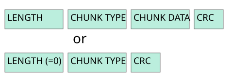
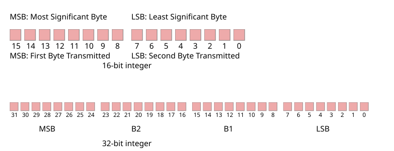
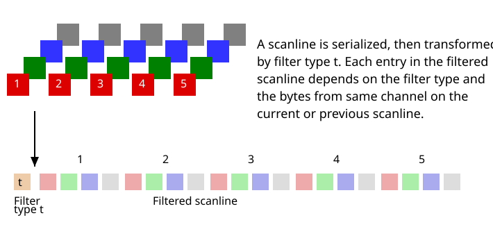

`png`全称叫`Portable Network Graphics`

`png`的spec在https://www.w3.org/TR/png-3/

`png`的类型有五种：
- Truecolor with alpha: red, green, blue, alpha.
- Greyscale with alpha: grey, alpha.
- Truecolor: red, green, blue.
- Greyscale: grey.
- Indexed-color: palette index.
## png签名
`png`的签名是`89 50 4E 47 0D 0A 1A 0A`

## chunk布局
`chunk`的结构是
长度(length)仅计算数据字段(chunk data)，不计算长度字段本身、数据块类型或 CRC。

数据块类型的每个字节都限定为十六进制值 41 到 5A 和 61 到 7A。

CRC 校验码是基于数据块的前几个字节计算的，包括数据块类型字段和数据块数据字段，但不包括长度字段。

## chunk命名惯例
辅助位：首字节	0（大写）= 关键，1（小写）= 辅助。

私有位（第二个字节）：0（大写）= 公有，1（小写）= 私有。

保留位：第三字节；在此版本的 PNG 中为 0。

可安全复制位：第四字节	0（大写）= 不可安全复制，1（小写）= 可安全复制。

## 颜色类型和值
| PNG image type       | Color type |
| -------------------- | ---------: |
| Greyscale            |          0 |
| Truecolor            |          2 |
| Indexed-color        |          3 |
| Greyscale with alpha |          4 |
| Truecolor with alpha |          6 |

## 整数和字节顺序


## Interlacing and pass extraction
现在一般不用这个了。

## 滤波


## 其他工具用法
```
exiftool -v5 1.png
mediainfo -f 1.png
pngcheck -cvvt 1.png
magick 1.png -depth 8 rgb:1.rgb
magick identify -verbose 1.png
magick 1.jpg -resize 50% 1.png
```